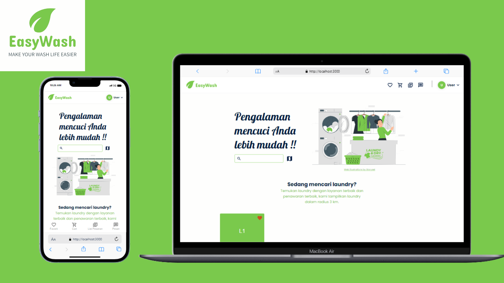
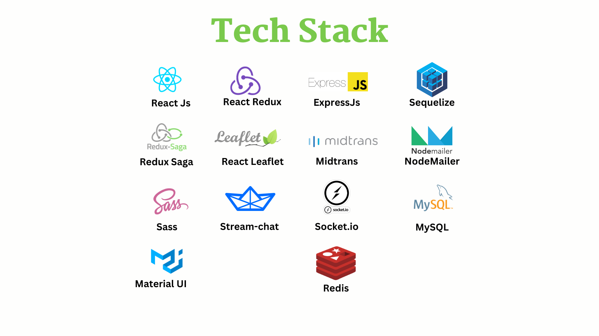

## Final Project-EasyWash

EasyWash is a laundry ordering service web application, the name EasyWash is taken from 2 words, namely the word easy which means easy or simple and the word wash which is synonymous with washing or laundry, This web application was created to fulfill the bootcamp final project. developed from December 4 to December 22, 2023

> **Note**
>
> This project is no longer being worked on.

## Stack

Summary of what the stack looks like now including a picture with the core tech:

- **Front-end** - React.js (vite) as the core framework, Material UI and sass for UI, Stream Chat library for chat feature,Midtrans Payment and React Leaflet for map.
- **Data** - All data is modeled and stored in MysqlDB.
- **API** - implement restfull api, for frontend and backend communication
- **Auth** - Uses a JsonWebToken(JWT) that is used to store user information, and is used to determine user authority. using Bcrypt for password hashing, and cryptoJs for encryption and decryption.

### Back-end

See more information about backend in [here](/server/README.md)

### Front-end

See more information about our [Front-end, components, routing and convention](/client/README.md)
