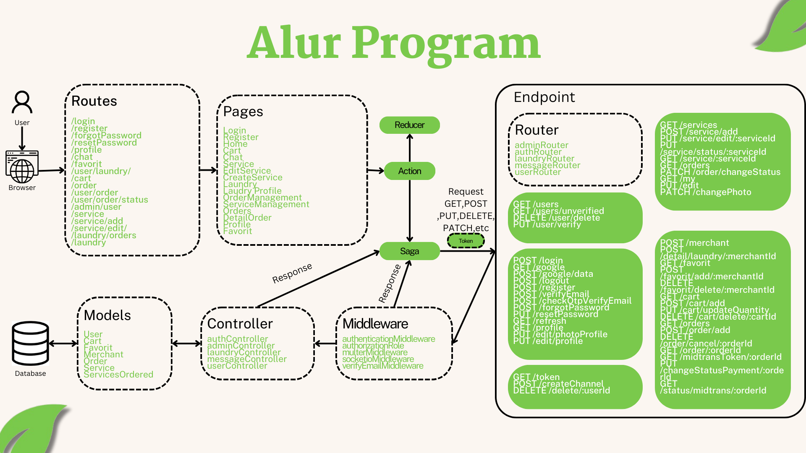

The front-end is built atop React.js(vite), and uses axios library to request data from back-ends - See [Stack](../README.md#Stack)

## Pages

`Pages` map to pages customers interact with, and integrate with their respective modules to fetch and manipulate data from back-ends

### Router

We use [Role and login guard](https://github.com/ahmadaliff/EasyWash-FinalProject/blob/main/client/src/components/ClientRoutes/index.jsx) to enforce authentication for routes that contain `protected` page.

| Route                  | Page            |
| ---------------------- | --------------- |
| /                      | Home            |
| /login                 | Login           |
| /register              | Register        |
| /forgotPassword        | ForgotPassword  |
| /resetPassword         | ResetPassword   |
| /profile               | Profile         |
| /chat                  | Chat            |
| /favorit               | Favorit         |
| /user/laundry/         | Laundry         |
| /cart                  | Cart            |
| /order                 | Order           |
| /user/order            | MyOrder         |
| /user/order/status     | StatusOrder     |
| /admin/user            | UserManagement  |
| /admin/deletedMerchant | DeletedMerchant |
| /service               | LaundryServices |
| /service/add           | FormService     |
| /service/edit/         | EditService     |
| /laundry/orders        | LaundryOrders   |
| /laundry               | Merchant        |
| /\*                    | NotFound        |

## Conventions

We use the following conventions to ease maintenance as we grow the number of modules and services:

- **Actions** - All interactions with back-ends regardless of its communication channel happen within each module's actions.js
- **Saga** - using redux-saga, a library that aims to make application side effects (i.e. asynchronous things like data fetching and impure things like accessing the browser cache) easier to manage, more efficient to execute, easy to test, and better at handling failures.
- **selectors** - using selectors for each pages
- **reducer** - using reducer for each page to store state in global state

## Running locally

You can run the front-end locally,

1. `npm install`
2. `npm run start`
3. `open in http://localhost:3000/`
